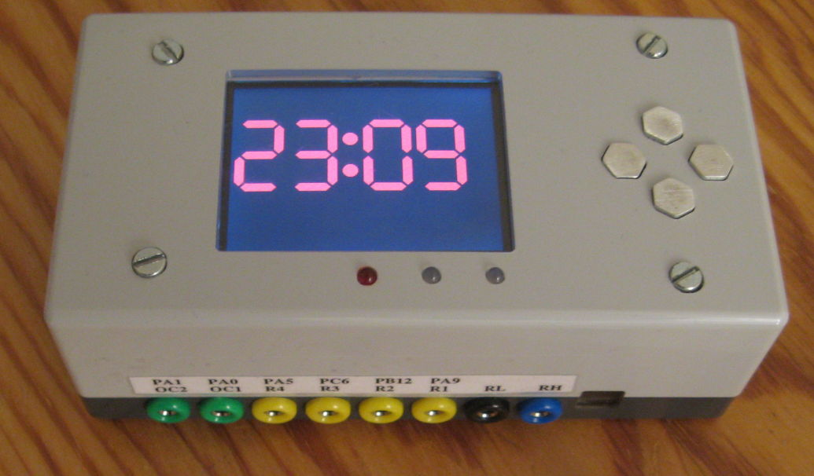
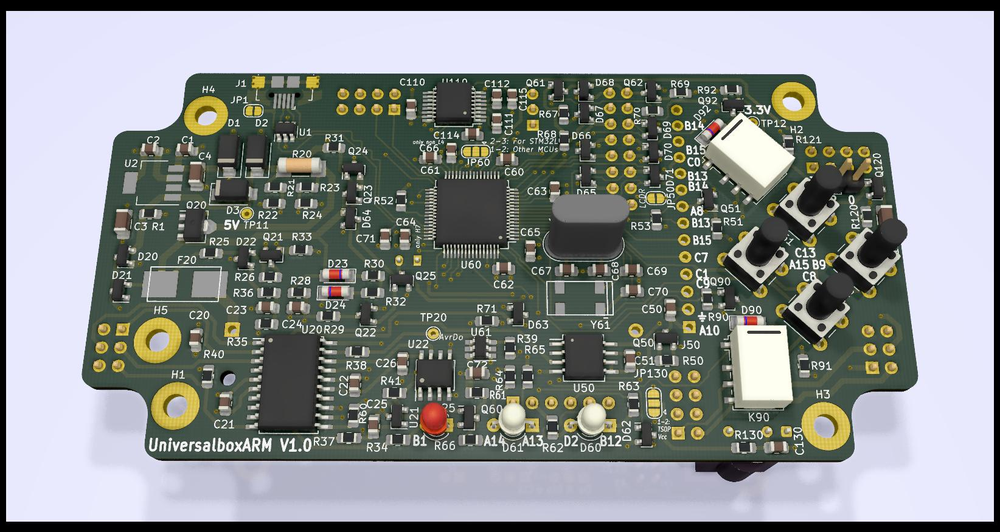
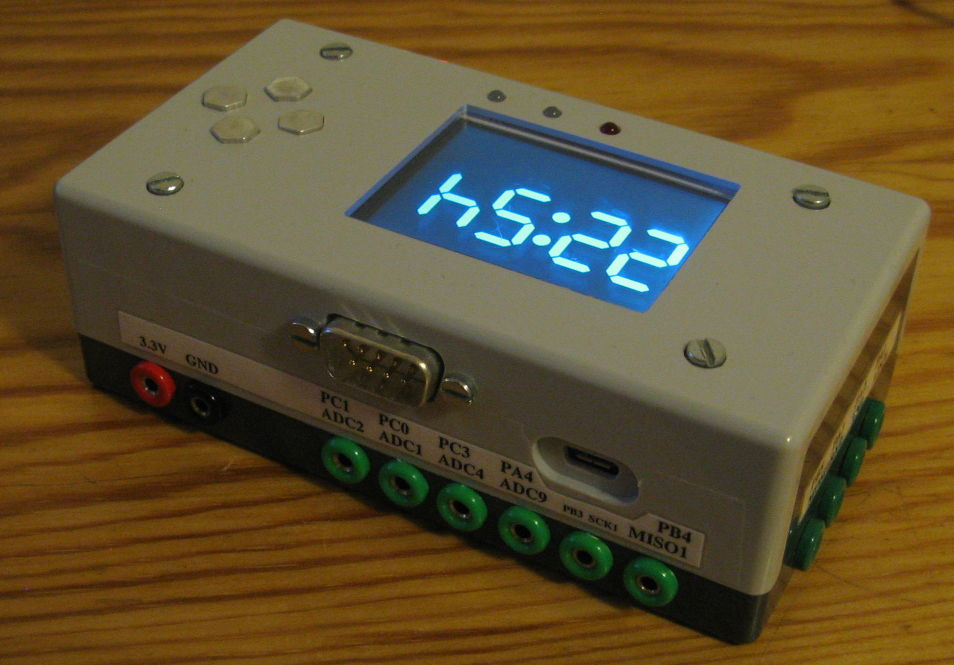

# UniversalboxArm

## Idea

Have a box for experiments and easy testing with a CPU which is more powerful than an AVR (Arduino)
and uses less energy than a Raspberry Pi.
Then add some common peripherals and fit this into a case.

## Features

The following hardware has been added. Not everything is required to be populated on the PCB.

- Various 64Pin STM32 MCUs possible

    - STM32L452RET (80MHz, 160KiB RAM) tested

- Runs from USB power

- Can run from a LiFePO battery and charge it

- 2x red-green duo LEDs

- Four buttons

- LCD socket

    - 128x128 (ST7735, tested), 160x128 (ST7735, untested) or 320x240 (ILI9341, tested) RGB LCDs are possible

- Four Relays

- External flash with up to 8MiB

- RS232 level converter

- IR receiver

- WLAN with an ESP-01

- Two open collector outputs

- Several ESD protected in and outputs

- AVR coprocessor for resetting and charge control

## Status

### Software

#### DFU loader for the ARM

A loader for the STM32 MCU is feature complete.

- Can be used by the common dfu-util delivered by the usual Linux distributions (like Debian)

- Accepts applications within a common .tar file together with some metadata

    - With the STM32L452 having 160KiB RAM, the tar file may be up to 128KiB in size.
Needing 2.5KiB overhead for the .tar format and the metadata, the binary may be up to 125.5KiB in size and after starting can use the full 160KiB for code + data.
Executing from RAM results in about 80% of the speed compared with executing from flash with the same CPU frequency.

- The application can be run directly from the RAM or stored into the external flash

    - Transferring to RAM is much faster than writing to the flash. Also there is no worry about the internal flash lifetime.

- Formats the external flash as FAT filesystem

- Allows configuring one of the three LCD sizes

    - Configuration is stored on the external flash and can be read by other applications

- With the four keys and the LCD, applications can be selected from the external flash and run without an USB connection

    - Can set one application as autostarting on power-on

- Each application can have a short descriptive text and explanation image to be shown on the LCD

    - The text can be up to 1KiB long and is taken from the readme.md of each firmware

    - The image is 3 bit RGB and must have the size of the selected LCD or one of the possible smaller LCDs.
Moreover the compressed data needs to fit within 7000byte. Due to RAM constraints, each 4x4 pixel block can not display pixel with more than two different colors.

#### Firmware for the coprocessor

- A long press of the left key resets the ARM processor

- A long press of the right key toggles if a reset should start the DFU bootloader from ST or the application from the flash (most likely the DFU bootloader described above)

- Supports a SPI communication to the ARM processor

    - ARM processor can request a reset

    - ARM processor can enable a watchdog

- The battery can be charged

- A wakeup time for the ARM processor can be set

#### More software

Software testing all the hardware to be working as intended has been written for the ARM processor and the AVR coprocessor.

There is a implementation for using the 8MiB flash as USB pen drive.

One application implements an NTP client and uses the display as digital clock.

See [readme.md](src/stm32l452/readme.md)

### Hardware

The PCB version 1 is working, but a lot of patching is required at several peripherals to use them.
With 380µA, the power down consumption is too high, as this would discharge a full battery within 65 days, and then the LiFePo must be considered defective.
The required changes are documented. Recreating a PCB version 1 is discouraged.
Instead the required changes need to be integrated into a version 2.

Milling the case is done.

See [readme.md](case/readme.md)