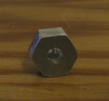

# Case

The openings are milled with a 2mm flute into a [BOPLA E430](https://www.bopla.de/en/enclosure-technology/element-universal/enclosure-6) case.

Everything is really cramped together in there and still could be placed some 0.1mm to look better. But it works.

A E435 with a height of 65mm instead of the 40mm would relax the spacing a lot.

The mill in use has a backslash of 0.1mm, so the files might be modified if the mill is better/worse than this.

The -test files are there to mill a sheet of cheap plastic to test out all the dimensions and to have something to position the mill right on the real case.

The left side could not be milled due to the limit in Z direction. There are no connections on the right and bottom.

# Buttons

The buttons are milled from 10mm aluminum plates (actually a 10.1mm was delivered).
It is difficult to get them right, as 0.2mm wrong in the one or other direction let them wiggle or let them sit so tight they are pressed permanently.

Also when buying 10mm alumium plates, they might be up to +-0.5mm in thickness and the files for milling need some adjustents according to the exact value.

Note, by screwing the case together, the surface also bends a little bit inward, which has to be taken care of too.

## File formats

.FCStd -> .step -> .heeks -> .ngc

## FreeCAD
All models were first created with [FreeCAD](https://www.freecad.org/) 0.21. If in doubt, try only this version to open the files.

FreeCAD saves its files as .FCstd. The 3D model is exported from FreeCAD as .step file.

## HeeksCAD
[HeeksCAD](https://github.com/Heeks/heekscad) together with [HeeksCNC](https://github.com/Heeks/heekscnc) Is used to create the paths for the CNC mill.

HeeksCAD imports .step files, saves them to .heeks and creates .ngc files.

Don't try to get HeeksCNC to work on a modern (Debian 12 as of writing this) system (HeeksCAD does work), it needs Python 2 with boost compiled against Python 2.
So instead set up a VM with Debian 10. HeeksCNC works fine with X-forwarding.

FreeCAD could be used to create the milling paths too, but the ones from HeeksCNC are better (as of 2023).

## Candle2

[Candle2](https://github.com/Schildkroet/Candle2) now reads the .ngc files and drives a modified Proxxon MF70 mill with [grbl](https://github.com/grbl/grbl).

## xfig

The .fig files can be opened by [xfig](https://mcj.sourceforge.net/). From there the .svg or .pdf files are exported.