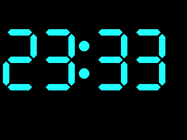
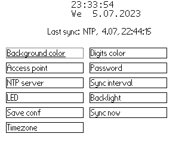

# Firmwares for the STM32L452 processor

## Common

Library code used by multiple projects.

## 01-blinky-hal

Project showing that running the ARM works. The LEDs D61 and D62 are blinking and
are responding to the four input keys. This project uses the HAL library from ST.

## 02-test-everything-hal

Uses a RS232 port with 19200baud to allow controlling all connected hardware.

## 03-loader

__Main firmware__ intended to be progammed into the internal flash.
Provides a DFU device via USB to upload new programs.
Also writes a configuration in the external flash for the selected LCD type.
Can store and load programs from the external flash. Formatting can be done too.
Debug prints are available over the RS232 port with 19200baud.

## 04-coprocessor-uart-forward

If the coprocessor is running the 02-test-everything firmware, it prints data at 1200baud on the pins connected to the ARM.
With this firmware the data is forwared to the RS232 port with 19200baud and prints the data on the LCD too.

## 05-coprocessor-control

If the coprocessor is running the 05-charger-with-spi firmware, this firmware allows reading out the charger state, resetting
the charger state and playing with the power off features.
Debug prints are available over the RS232 port with 19200baud.

## 06-usb-mass-storage

Connect the external SPI flash as USB mass storage device to the PC, allows reading and writing files on the disk.
As always, Debug prints are available over the RS232 port with 19200baud.

## 07-ntp-clock

Shows a big digital clock on the screen. Foreground and background color can be configured out of 256 colors.
The clock is synced over WIFI with an NTP server, therefore AP, password and NTP server can be set.
The backlight level and timezone can be set and the internal clock is calibrated automatically
when there are two syncs with enough time inbetween.
If a battery is connected, the clock continues to run while the device is off.
To allow updateing the GUI while the WIFI is served, FreeRTOS is used.
All settings are saved to the filesystem.
Debug prints are available over the RS232 port with 19200baud.
Also entering the AP and password is much easier over the RS232 port.

## 08-freertos-helloworld
Simple example how to use FreeRTOS.
Starts four threads, one for reading the serial port, one for resetting the watchdog, one for flashing the LEDs and one for reading the buttons.

## 09-gamebox

Port of an old project, originally written for an AVR with a red/green LED matrix.
Play Tetris, Snake, Four winns, Reversi, Race or Pong with just 16x16 pixels and 4 bit colors.
Also contains a demo.
Best used with an analogue joystick. But the input keys work too.
Tetris, Snake, Four winns, Reversi can also be played over the RS232 input, using w-a-s-d as cursor and space for enter.
The sourcecode is pretty old and still commented in german.
Running the gamebox on the AVR can be watched on [Youtube](https://www.youtube.com/watch?v=83r08iD9ZAA)
The connection of the analogue joystick to the STM32 is as follow:

## 10-infrared-decoder

Prints the protocol, address, command and flags of many infrared remote controls on the LCD and
serial port.

